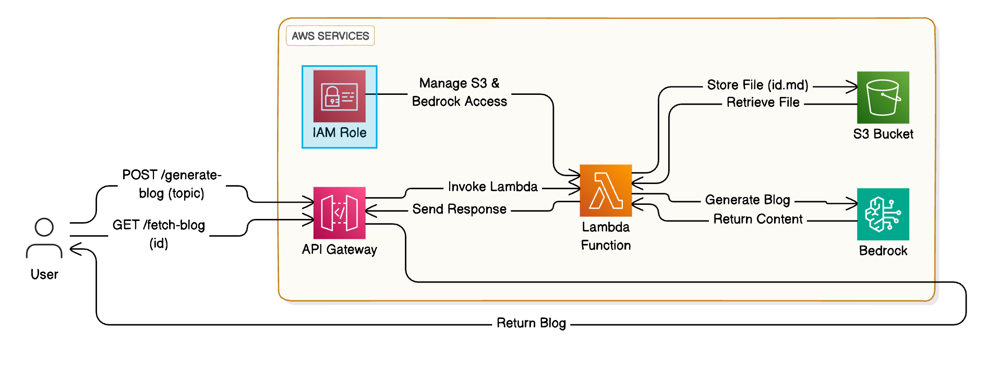

## Introduction
<Callout type="warning">
In an era where content is king, automating content generation can be a game-changer. I embarked on a project to build a serverless Markdown blog generator using AWS Lambda and Amazon Bedrock. This project not only honed my technical skills but also showcased my ability to navigate challenges and implement effective solutions.

This report documents the journey, challenges faced, and the solutions implemented, providing insights into my problem-solving approach and technical expertise.
</Callout>


In this tutorial, we'll walk through building a serverless blog generator using Amazon Bedrock's foundation models and AWS Lambda, generating markdown-formatted blog posts. We'll cover:

1. Setting up the AWS Lambda function.
2. Configuring API Gateway for handling requests.
3. Overcoming challenges during development.
4. Saving generated markdown blogs to S3.

---

## Project Overview

The goal was to create a serverless application that:

- Generates markdown-formatted blog posts based on user input.
- Utilizes Amazon Bedrock's foundation models for content generation.
- Stores generated content securely in Amazon S3.
- Exposes APIs via AWS API Gateway for interaction.
- Implements rate limiting to prevent abuse and manage costs.

---
## Architecture Diagram

 

---
## Technologies Used

Technologies Used
- **AWS Lambda**: For running serverless functions.
- **Amazon Bedrock**: To access foundation models for content generation.
- **Amazon S3**: For storing generated blog content.
- **AWS API Gateway**: To expose APIs for content generation and retrieval.
- **Python**: Programming language for Lambda functions.
- **Boto3**: AWS SDK for Python to interact with AWS services.

---
## Development Process

### Step 1: Setting Up AWS Lambda Function

We began by creating a Lambda function that would handle both the generation of blog content and its storage in S3.

Key Actions:
- Imported Necessary Libraries:
```python showLineNumbers
import boto3
import botocore.config
import json
import uuid
import os
import logging
```

- Setup Logging:
```python showLineNumbers
logger = logging.getLogger()
logger.setLevel(logging.INFO)
```

- Configured IAM Role:
    - Attached `AmazonBedrockFullAccess` and `AmazonS3FullAccess` policies to the Lambda execution role.
    - Recognized that in a production environment, following the principle of **least privilege** is essential.
---
### Step 2: Interacting with Amazon Bedrock Models

Initially, we faced issues invoking the Bedrock models due to outdated `boto3` versions in Lambda.

#### Challenges and Solutions:
- **Challenge**: Lambda's built-in `boto3` didn't support Bedrock.

- **Solution**:
    - Created a **Lambda Layer** with the latest Boto3 version.
    - Steps:
        ```bash
        mkdir python
        cd python
        pip install boto3 -t .
        zip -r boto3_layer.zip python
        ```
    - Uploaded `boto3_layer.zip` as a Lambda Layer and attached it to the function.

- **Challenge**: Incorrect service name when initializing the Bedrock client.
- **Solution**:
    - Corrected the service name from `"bedrock_runtime"` to `"bedrock-runtime"` in the Boto3 client initialization.
    ```python /bedrock-runtime/
    bedrock = boto3.client("bedrock-runtime", ...)
    ```
---
### Step 3: Crafting the Prompt for Content Generation

The prompt plays a crucial role in guiding the AI model to produce the desired output.

**Iterations:
- First Attempt:
    - Initial prompt led to outputs with irrelevant sections like market trends, even for topics like `"Hello World in multiple coding languages."`

- Refinement:
    - Adjusted the prompt to be more specific and removed unnecessary sections.
    - Focused on instructing the model to use appropriate markdown syntax and to cover relevant aspects of the topic.

```python showLineNumbers
prompt = f"""
<s>[INST]Human: Write a comprehensive blog post on "{query}" in markdown format. Use appropriate markdown syntax, including:

- Headings (#, ##, ###)
- Bullet points (*, -)
- Numbered lists (1., 2., 3.)
- Code blocks (```) for any code snippets
- Italics (*) and bold (**) for emphasis
- Hyperlinks ([text](URL)) where relevant

Provide an in-depth analysis covering all relevant aspects of the topic, including practical examples, statistics, and real-world applications where appropriate. 

The style should mirror detailed articles found in respected tech publications like *Wired* or *TechCrunch*, focusing on clarity, depth, and expert insight.

The narrative should be from the perspective of a technology expert, using professional yet accessible language. 

Organize the blog with clear and logical subheadings that suit the content, ensuring a smooth flow of ideas. 

Begin with an engaging introduction to set the context and conclude with a thoughtful summary or call to action. Do not include an image.

The tone should be informative, authoritative, and engaging, designed to keep tech enthusiasts informed and captivated throughout the article. 

Ensure the content is original, free of plagiarism, and optimized for readability.

Assistant:[/INST]</s>
"""
```

- **Outcome:**
    - The refined prompt resulted in more accurate and relevant content generation.
---

### Step 4: Implementing the Lambda Handler and Generating S3 Content

In this step, we implemented the Lambda handler to process incoming API requests, generate blog content using Amazon Bedrock, save the content to S3, and return the appropriate response.

**Implementation Details:**
- **Lambda Handler Function:** The Lambda function handles both `POST` (for generating and saving blog content) and `GET` (for retrieving blog content) requests.

```python showLineNumbers 
def lambda_handler(event, context):
    logger.info(f"Received event: {json.dumps(event)}")

    try:
        # Determine the HTTP method
        http_method = event.get('httpMethod', event.get('requestContext', {}).get('http', {}).get('method', ''))
        logger.info(f"HTTP method: {http_method}")

        # Handle POST request for blog generation
        if http_method == 'POST':
            event_body = json.loads(event.get('body', '{}'))
            blog_topic = event_body.get('blogTopic', "")

            if not blog_topic:
                logger.error("Blog topic is missing from the request body")
                return {
                    'statusCode': 400,
                    'headers': {
                        'Access-Control-Allow-Origin': '*',
                        'Access-Control-Allow-Headers': 'Content-Type',
                        'Access-Control-Allow-Methods': 'OPTIONS,POST,GET'
                    },
                    'body': json.dumps({'error': 'Blog topic is required.', 'blogId': None})
                }

            # Generate the blog content
            blog_content = generate_blog_content(query=blog_topic)

            if not blog_content:
                logger.error("Failed to generate blog content")
                return {
                    'statusCode': 500,
                    'headers': {
                        'Access-Control-Allow-Origin': '*',
                        'Access-Control-Allow-Headers': 'Content-Type',
                        'Access-Control-Allow-Methods': 'OPTIONS,POST,GET'
                    },
                    'body': json.dumps({'error': 'Error generating the blog content.', 'blogId': None})
                }

            # Generate a unique ID for the blog post
            blog_id = str(uuid.uuid4())

            # Generate a unique key for the S3 object using the blog_id
            s3_key = f"blogs/{blog_id}.md"
            s3_bucket = "your-s3-bucket-name"  # Replace with your actual S3 bucket name

            # Save the generated blog content to S3
            save_blog_to_s3(s3_key, s3_bucket, blog_content)

            # Return success with the blog ID
            return {
                'statusCode': 200,
                'headers': {
                    'Access-Control-Allow-Origin': '*',
                    'Access-Control-Allow-Headers': 'Content-Type',
                    'Access-Control-Allow-Methods': 'OPTIONS,POST,GET'
                },
                'body': json.dumps({
                    'message': 'Blog generation and saving are completed!',
                    'blogId': blog_id
                })
            }

        # Handle GET request for blog retrieval
        elif http_method == 'GET':
            # ... (retrieval code as previously detailed)
            pass

        else:
            logger.error(f"Unsupported HTTP method: {http_method}")
            return {
                'statusCode': 405,
                'headers': {
                    'Access-Control-Allow-Origin': '*',
                    'Access-Control-Allow-Headers': 'Content-Type',
                    'Access-Control-Allow-Methods': 'OPTIONS,POST,GET'
                },
                'body': json.dumps({'error': 'Method Not Allowed'})
            }

    except Exception as e:
        logger.error(f"Unexpected error in lambda_handler: {e}", exc_info=True)
        return {
            'statusCode': 500,
            'headers': {
                'Access-Control-Allow-Origin': '*',
                'Access-Control-Allow-Headers': 'Content-Type',
                'Access-Control-Allow-Methods': 'OPTIONS,POST,GET'
            },
            'body': json.dumps({'error': 'Internal server error', 'blogId': None})
        }

```
**Explanation**:
- **Processing the Event**: The handler first logs the event and determines the HTTP method.
    - For POST requests, it extracts the blogTopic from the request body and ensures it's not empty. If valid, it calls the generate_blog_content function to generate markdown content.
    - After successful generation, a unique blog ID is created, and the content is saved to S3.
- **Generating Blog Content**: The generate_blog_content function interacts with Amazon Bedrock to create content based on the provided blog topic.
- **Saving to S3**: The blog content is stored in an S3 bucket, and a success response is returned with the blog ID.

##### Blog Content Generation

```python showLineNumbers
def generate_blog_content(query: str) -> str:
    prompt = f"""
<s>[INST]Human: Write a comprehensive blog post on "{query}" in markdown format. Use appropriate markdown syntax, including:

- Headings (#, ##, ###)
- Bullet points (*, -)
- Numbered lists (1., 2., 3.)
- Code blocks (```) for any code snippets
- Italics (*) and bold (**) for emphasis
- Hyperlinks ([text](URL)) where relevant

Provide an in-depth analysis covering all relevant aspects of the topic, including practical examples, statistics, and real-world applications where appropriate. 

The style should mirror detailed articles found in respected tech publications like *Wired* or *TechCrunch*, focusing on clarity, depth, and expert insight.

The tone should be informative, authoritative, and engaging.

Assistant:[/INST]</s>
    """

    body = {
        "prompt": prompt,
        "max_gen_len": 1024,
        "temperature": 0.5,
        "top_p": 0.9,
    }

    try:
        bedrock = boto3.client(
            "bedrock-runtime",
            region_name=os.environ.get('REGION', 'us-east-1'),
            config=botocore.config.Config(read_timeout=300, retries={'max_attempts': 3})
        )

        response = bedrock.invoke_model(
            body=json.dumps(body),
            modelId="meta.llama3-70b-instruct-v1:0"
        )

        response_content = response['body'].read().decode('utf-8')
        response_data = json.loads(response_content)
        blog_content = response_data.get('generation', "")

        logger.info(f"Generated blog content: {blog_content[:100]}...")
        return blog_content

    except Exception as e:
        logger.error(f"Error generating the blog: {e}", exc_info=True)
        raise

```
**Explanation**:
- **Amazon Bedrock Integration**: It uses Boto3 to call Amazon Bedrock for generating the content.
- **Response Parsing**: The generated content is extracted from the response and returned.
- **Error Handling**: The function includes error handling to catch and log any issues during the generation process.

**Challenges and Solutions:**
- **Challenge**: Ensuring the Lambda function correctly handles content generation and storage without errors.
    - **Solution**: Detailed logging and error handling were added at each step, allowing easier debugging using AWS CloudWatch Logs.

- **Challenge**: Managing the S3 interaction and ensuring the content is saved securely.
    - **Solution**: The Lambda function generates a `unique S3` key for each blog post, ensuring no content overlap or overwriting.

- **Challenge**: Seamless content generation using Amazon Bedrock without delays.
    - **Solution**: Configured Boto3 client with appropriate timeouts and retries to handle model invocation efficiently.


---
### Step 5: Saving the Blog Content to S3

After generating the blog content, the next step was to save it to Amazon S3 for storage and retrieval.

**Implementation Details:**

- **Save Blog to S3 Function:**

```python showLineNumbers
def save_blog_to_s3(s3_key: str, s3_bucket: str, blog_content: str):
    s3 = boto3.client('s3')

    try:
        s3.put_object(Bucket=s3_bucket, Key=s3_key, Body=blog_content, ContentType='text/markdown')
        logger.info(f"Blog saved to S3 at {s3_key}.")
    except Exception as e:
        logger.error(f"Error saving the blog to S3: {e}", exc_info=True)
        raise
```

**Challenges and Solutions:**

- **Challenge**: The Lambda function initially lacked the necessary permissions to access the S3 bucket.
- **Solution**:
    - Ensured that the IAM role attached to the Lambda function included permissions to interact with S3.
    - Added the `AmazonS3FullAccess` policy for testing purposes.
    - Have planned to refine permissions using the least privilege principle in production.


### Step 6: Setting Up API Gateway

To allow users to interact with the application via HTTP requests, we set up AWS API Gateway to expose the Lambda function as a REST API.
**Actions Taken:**
- **Created a REST API:**
    - Named it `BlogGenAPI` for clarity.
- **Defined Resources and Methods:**
    - Resource: `/blog-generation`
    - Methods:
        - `POST`: For generating new blog posts.
        - `GET`: For retrieving existing blog posts.
- **Lambda Integration:**
    - Configured the API Gateway to integrate with the Lambda function using Lambda Proxy Integration.
- **Enabled CORS (Cross-Origin Resource Sharing):**
    - Added appropriate headers in both the Lambda function responses and API Gateway settings to allow cross-origin requests.

```json showLineNumbers
'headers': {
    'Access-Control-Allow-Origin': '*',
    'Access-Control-Allow-Headers': 'Content-Type',
    'Access-Control-Allow-Methods': 'OPTIONS,POST,GET'
}
```
**Deployed the API:**

- Created a deployment stage named `dev`.
- Deployed the API to make it accessible via a public endpoint.

**Challenges and Solutions:**
- **Challenge**: Encountered CORS errors when making requests from the frontend application.
- **Solution**:
    - Reviewed and updated the API Gateway configurations to ensure that CORS was properly enabled.
    - Verified that the Lambda function included the necessary CORS headers in its responses.

---

### Step 7: Implementing Secure Content Retrieval
Initially, we used presigned URLs to allow users to retrieve the generated blog content from S3. However, this approach had security implications.

**Challenges and Solutions:**
- **Challenge**: Presigned URLs exposed sensitive information, such as the S3 bucket name and access parameters, in the frontend application.
- **Solution**:
    - Modified the Lambda function to handle content retrieval directly.
    - Instead of generating presigned URLs, the GET method in the Lambda function now retrieves the blog content from S3 and returns it in the API response.

**Updated Lambda Handler for GET Requests:**
```python showLineNumbers
def lambda_handler(event, context):
    # ... (POST method handling code)

    elif http_method == 'GET':
        blog_id = event.get('queryStringParameters', {}).get('id', '')
        if not blog_id:
            return {
                'statusCode': 400,
                'headers': {
                    'Access-Control-Allow-Origin': '*',
                    'Access-Control-Allow-Headers': 'Content-Type',
                    'Access-Control-Allow-Methods': 'OPTIONS,POST,GET'
                },
                'body': json.dumps({'error': 'Blog ID is required.'})
            }
        s3_key = f"blogs/{blog_id}.md"
        s3_bucket = "your-s3-bucket-name"  # Replace with your S3 bucket name

        blog_content = get_blog_content_from_s3(s3_key, s3_bucket)
        return {
            'statusCode': 200,
            'headers': {
                'Access-Control-Allow-Origin': '*',
                'Access-Control-Allow-Headers': 'Content-Type',
                'Access-Control-Allow-Methods': 'OPTIONS,POST,GET'
            },
            'body': json.dumps({'blogContent': blog_content, 'blogId': blog_id})
        }
    # ... (other code)
```
**Benefits:**
- Enhanced security by not exposing S3 bucket details in the frontend.
- Simplified the process of retrieving content.


---
### Step 8: Implementing Rate Limiting
To prevent abuse and manage costs, we implemented rate limiting on the API endpoints.

**Actions Taken:**
- **Created a Usage Plan in API Gateway:**
    - Set throttle limits (e.g., 10 requests per second) and burst limits.
    - Defined a quota (e.g., 1000 requests per month).
- **Generated API Keys:**
    - Created API keys to control access to the API.
    - Associated these keys with the usage plan.
- **Associated API Stages with the Usage Plan:**
    - Linked the dev stage of the API with the usage plan.
- **Required API Key for Methods:**
    - Configured the POST and GET methods to require an API key.

**Challenges and Solutions:**
- **Challenge**: Ensuring that legitimate users were not adversely affected by rate limits.
- **Solution**:
    - Carefully configured rate limits based on expected traffic.
    - Monitored usage to adjust limits as necessary.

---
### Testing and Validation
We conducted extensive testing to ensure that all components functioned correctly and securely.

**Testing Steps:**
- **Blog Generation (POST Request):**
    - Sent `POST` requests to `/blog-generation` with various topics.
    - Verified that the Lambda function generated content and saved it to S3.
    - Ensured that the response included a `blogId` for retrieval.
- **Blog Retrieval (GET Request):**
    - Sent `GET` requests to `/blog-generation` with the `blogId` query parameter.
    - Confirmed that the Lambda function retrieved the correct content from S3.
    - Checked that the response included the `blogContent`.
- **Error Handling:**
    - Tested API responses with invalid or missing parameters.
    - Verified that appropriate error messages and HTTP status codes were returned.
- **Rate Limiting:**
    - Simulated high-frequency requests to test rate limiting.
    - Ensured that requests exceeding the limit received `429 Too Many Requests` responses.
- **Tools Used:**
    - Postman: For crafting and sending HTTP requests.
    - AWS CloudWatch Logs: For monitoring Lambda function logs and debugging.
    - Curl: Command-line tool for testing API endpoints.
---

### Challenges Faced and Problem-Solving Approach
Throughout the project, several challenges arose. Here's how we addressed them:

#### Challenge 1: Lambda Function Permissions
- **Issue**: The Lambda function lacked permissions to interact with Amazon Bedrock and S3.
- **Solution**:
    - Reviewed and updated the IAM role attached to the Lambda function.
    - Added necessary policies (AmazonBedrockFullAccess, AmazonS3FullAccess) for development.
    - Noted the importance of applying the principle of least privilege in production.


#### Challenge 2: Outdated Boto3 Version in Lambda
- **Issue**: The default Boto3 version in Lambda did not support invoking Amazon Bedrock models.
- **Solution**:
    - Created a Lambda Layer with the latest Boto3 version.
    - Attached the layer to the Lambda function to ensure compatibility.

#### Challenge 3: Incorrect Bedrock Client Initialization
- **Issue**: Incorrect service name ("bedrock_runtime" instead of "bedrock-runtime") when initializing the Bedrock client.
- **Solution**:
    - Identified the typo in the service name.
    - Corrected the service name in the code.

#### Challenge 4: Ineffective Prompt Design
- **Issue**: The AI model's output included irrelevant content due to an ineffective prompt.
- **Solution**:
    - Refined the prompt to be more specific and instructive.
    - Removed unnecessary sections that caused the model to include irrelevant content.
    - Focused the prompt on desired formatting and content guidelines.

#### Challenge 5: Exposing S3 Presigned URLs
- **Issue**: Presigned URLs in the frontend exposed sensitive information.
- **Solution**:
    - Modified the Lambda function to retrieve and return blog content directly.
    - Eliminated the need to expose presigned URLs.

#### Challenge 6: CORS Issues
- **Issue**: Encountered CORS errors when making API requests from the frontend.
- **Solution**:
    - Ensured that the Lambda function responses included the necessary CORS headers.
    - Configured API Gateway to handle CORS preflight requests.

---
### Key Learnings

- **Effective Prompt Engineering**: Crafting precise prompts is essential when working with AI models to obtain relevant outputs.

- **AWS Service Integration**: Deepened understanding of integrating AWS Lambda, Amazon Bedrock, API Gateway, and S3.

- **Security Best Practices**: Recognized the importance of securing APIs and handling sensitive information appropriately.

- **Troubleshooting Skills**: Enhanced problem-solving abilities through debugging and log analysis using CloudWatch.

- **Scalability Considerations**: Implemented rate limiting to ensure the application remains scalable and cost-effective.

---
### Conclusion
This project was an invaluable experience that allowed us to apply and expand our knowledge in cloud computing and serverless architectures. By overcoming various challenges, we demonstrated resilience and a proactive approach to problem-solving.

The final application is a robust, secure, and scalable serverless blog generator that leverages cutting-edge technologies like Amazon Bedrock. This project not only meets the initial goals but also serves as a testament to our technical capabilities and adaptability.


---
### Next Steps

- Enhance Frontend Application:
    - Develop a user-friendly interface for users to generate and read blogs. Already a demo available [here](https://bucketbyte.com/).
    - Implement authentication and user management features.
- Optimize Costs:
    - Review resource utilization to identify cost-saving opportunities.
    - Consider implementing caching strategies to reduce API calls.
- Expand Functionality:
    - Introduce features such as blog editing, categorization, and search functionality.
    - Integrate with other AWS services like DynamoDB for storing metadata.

---

## References
- AWS Lambda Documentation: https://docs.aws.amazon.com/lambda/
- Amazon Bedrock Documentation: https://aws.amazon.com/bedrock/
- API Gateway Rate Limiting: https://docs.aws.amazon.com/apigateway/latest/developerguide/api-gateway-request-throttling.html
- Using Presigned URLs in S3: https://docs.aws.amazon.com/AmazonS3/latest/userguide/ShareObjectPreSignedURL.html
- AWS Boto3 SDK: https://boto3.amazonaws.com/v1/documentation/api/latest/index.html

---
## Appendix

You can find the complete code for the serverless blog generator [here](https://github.com/sahilshenoy/bucket-byte-backend).

You can find the frontend code for the serverless blog generator [here](https://github.com/sahilshenoy/bucket-byte).

---

By documenting this project comprehensively, we aim to provide recruiters and potential employers with a clear understanding of our technical skills, problem-solving approach, and ability to deliver robust solutions in cloud computing environments.


